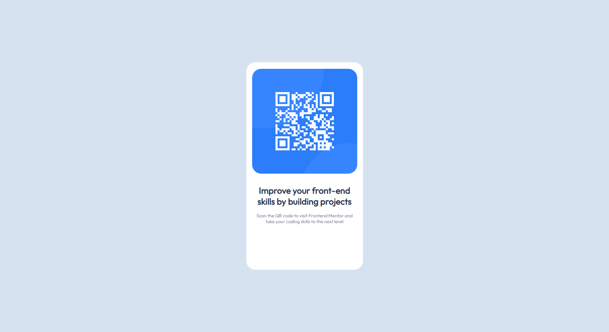

# QR Code exercise - Frontend Mentor

This is a solution to the [QR code component challenge on Frontend Mentor](https://www.frontendmentor.io/challenges/qr-code-component-iux_sIO_H). Frontend Mentor challenges help you improve your coding skills by building realistic projects.

## Table of contents

- [Overview](#overview)
  - [Screenshot](#screenshot)
  - [Links](#links)
- [My process](#my-process)
  - [Built with](#built-with)
  - [What I learned](#what-i-learned)
  - [Continued development](#continued-development)
- [Author](#author)

## Overview

### Screenshot

### Links

- Solution URL: [Add solution URL here](https://github.com/MiguelR0drigues/QR-Code-exercise)
- Live Site URL: [Add live site URL here](https://miguelr0drigues.github.io/QR-Code-exercise/)

## My process

### Built with

- Semantic HTML5 markup
- CSS custom properties
- Flexbox

### What I learned

Better understanding of the CSS properties.
I was mostly practicing already known skills.

### Continued development

Need to pay more atention to responsive design.
Most of my work are not fully resizable.

## Author

- LinkedIn - [@miguel-r0drigues](https://www.linkedin.com/in/miguel-r0drigues/)
- Github - [@MiguelR0drigues](https://github.com/MiguelR0drigues)
- Frontend Mentor - [@MiguelR0drigues](https://www.frontendmentor.io/profile/MiguelR0drigues)
